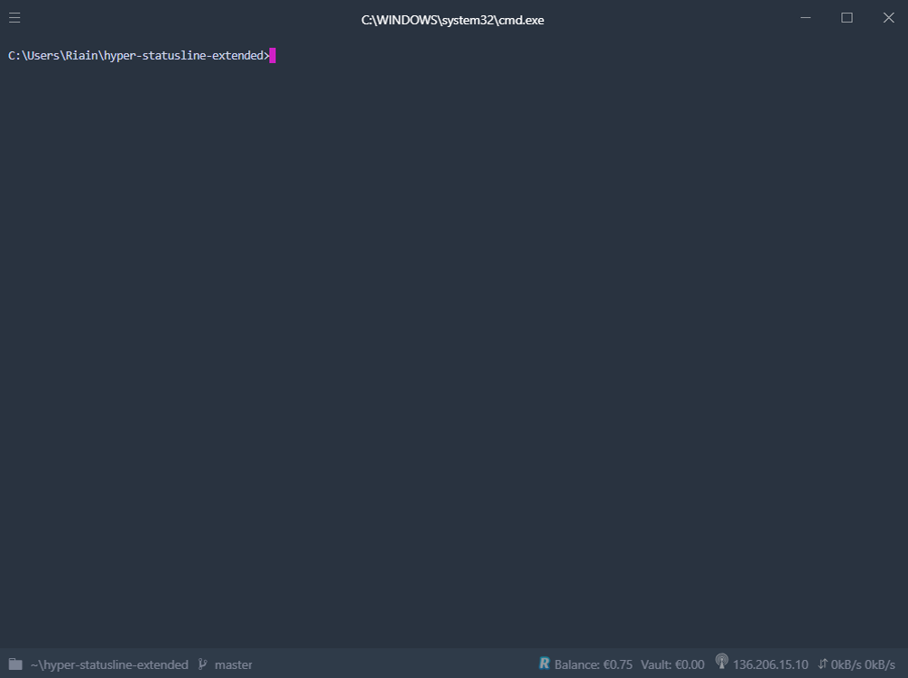

# hyper-statusline-extended

**hyper-statusline-extended** is an extension and rewrite of [henrikdahl's](https://github.com/henrikdahl/) [hyper-statusline](https://github.com/henrikdahl/hyper-statusline) plugin for [Hyper](https://hyper.is).



## Installation

Add the following to your hyper config.

```js
    module.exports = {
        ...

        plugins: ["hyper-statusline-extended"]

        ...
    }
```

Or, install it via the CLI, like so, and then restart Hyper.

```
hyper i hyper-statusline-extended
```

## Config

Add the following to your Hyper config's config object.

### Revolut

**Note** to use this, you need to have [tducret's Revolut API](https://github.com/tducret/revolut-python) and a Revolut API token, follow their doc's to get one.
If you have more than one balance/vault set, you can then cycle through them by clicking the component on the status line.

```js
revolut: {
        balanceCurrencies: [], // Can include 'EUR', 'USD', and/or 'GBP'
        vaultCurrencies: [], // Can include 'EUR', 'USD', and/or 'GBP'
        REV_TOKEN: '<revolutToken>',
        REV_API_PATH: '<pathToRevolutAPI>'
}

```

### Change Git Dirty Color

Expected value is `CSS color`

```js
    hyperStatusLine: {
        dirtyColor: 'salmon',
    }
```

### Change Git Ahead Color

Expected value is `CSS color`

```js
    hyperStatusLine: {
        aheadColor: 'ivory',
    }
```

### Disable Footer Transparency

Default value is set to `true`

```js
    hyperStatusLine: {
        footerTransparent: false,
    }
```

## To Do

- Add tests for each component
- Add battery information
- Look into Spotify Web SDK and if it can be used within Electron (Widevine CDM may prevent this)
- Add ability to change IP showing (local/external)

## Extra

- [Theme: hyper-chesterish](https://github.com/henrikdahl/hyper-chesterish)
